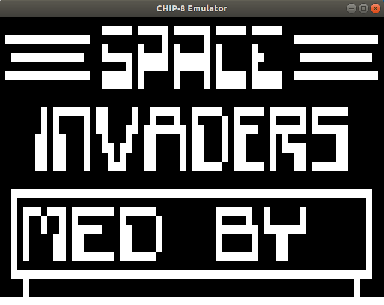
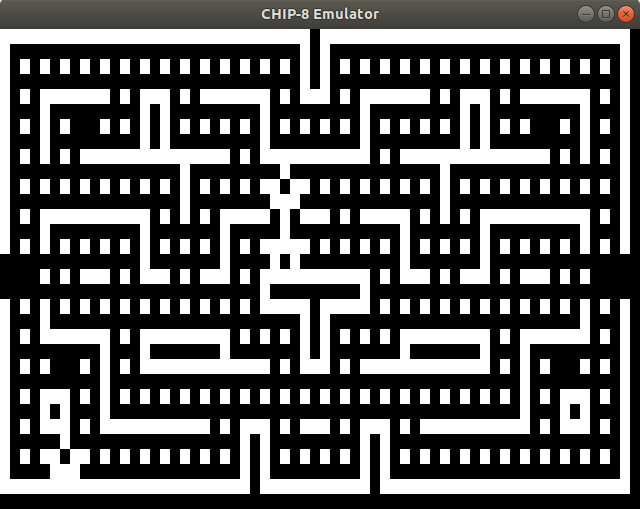

# Chip8
CHIP-8 is an interpreted programming language, developed by Joseph Weisbecker. It was initially used on the COSMAC VIP and Telmac 1800 8-bit microcomputers in the mid-1970s. CHIP-8 programs are run on a CHIP-8 virtual machine. It was made to allow video games to be more easily programmed for these computers.

## Dependencies for Running Locally
* cmake >= 3.7
  * All OSes: [click here for installation instructions](https://cmake.org/install/)
* make >= 4.1 (Linux, Mac), 3.81 (Windows)
  * Linux: make is installed by default on most Linux distros
  * Mac: [install Xcode command line tools to get make](https://developer.apple.com/xcode/features/)
  * Windows: [Click here for installation instructions](http://gnuwin32.sourceforge.net/packages/make.htm)
* SDL2 >= 2.0
  * All installation instructions can be found [here](https://wiki.libsdl.org/Installation)
  * Note that for Linux, an `apt` or `apt-get` installation is preferred to building from source.
* gcc/g++ >= 5.4
  * Linux: gcc / g++ is installed by default on most Linux distros
  * Mac: same deal as make - [install Xcode command line tools](https://developer.apple.com/xcode/features/)
  * Windows: recommend using [MinGW](http://www.mingw.org/)

## Basic Build Instructions
1. Clone this repo.

### Linux/Mac
2. Make a build directory in the top level directory: `mkdir build && cd build`
3. Compile: `cmake .. && make`
4. Run it: `./Chip8 <rom_name>`. You can choose one from the 23 public domain ROMs in the `roms` directory.

### Windows
2. Import the project on Visual Studio
3. Run it passing a rom file as param

## Controls
```
Keypad                   Keyboard
+-+-+-+-+                +-+-+-+-+
|1|2|3|C|                |1|2|3|4|
+-+-+-+-+                +-+-+-+-+
|4|5|6|D|                |Q|W|E|R|
+-+-+-+-+       =>       +-+-+-+-+
|7|8|9|E|                |A|S|D|F|
+-+-+-+-+                +-+-+-+-+
|A|0|B|F|                |Z|X|C|V|
+-+-+-+-+                +-+-+-+-+
```

## Testing the implementation
There are two roms that can be used to check the CPU:

##### [BC_test](https://slack-files.com/T3CH37TNX-F3RKEUKL4-b05ab4930d)
`./Chip8 ../roms/test/BC_test.ch8`

##### [chip8-test-rom](https://github.com/corax89/chip8-test-rom)
`./Chip8 ../roms/test/chip8-test-rom.ch8`

## Rubric points addressed
### Loops, Functions, I/O
| Rubric point  | Location |
| ------------- | ------------- |
| The project demonstrates an understanding of C++ functions and control structures.  |   Yes, check all the files
| The project reads data from a file and process the data, or the program writes data to a file.  | [Memory](src/Memory.cpp) and [Beeper](src/Beeper.cpp)
The project accepts user input and processes the input.  |   [main](src/main.cpp)

### Object Oriented Programming
| Rubric point  | Location |
| ------------- | ------------- |
| The project uses Object Oriented Programming techniques.  |   Yes, check all the files
Classes use appropriate access specifiers for class members. | Yes, check all the files
Class constructors utilize member initialization lists. | Yes, check all the files
Classes abstract implementation details from their interfaces. | Yes, check all the files
Classes encapsulate behavior. | Yes, check all the files

### Memory Management
| Rubric point  | Location |
| ------------- | ------------- |
| The project makes use of references in function declarations.  |   [CPU](src/Cpu.cpp)
The project uses destructors appropriately. | [Renderer](src/Renderer.cpp) and [Beeper](src/Beeper.cpp)
The project uses scope / Resource Acquisition Is Initialization (RAII) where appropriate. | Yes, check all the files
The project follows the Rule of 5. | Yes, check all the files

## References
http://devernay.free.fr/hacks/chip8/C8TECH10.HTM#Ex9E

http://www.multigesture.net/articles/how-to-write-an-emulator-chip-8-interpreter/

https://www.youtube.com/watch?v=rpLoS7B6T94

https://austinmorlan.com/posts/chip8_emulator/

## Screenshots

### Space Invaders


### BLINKY

